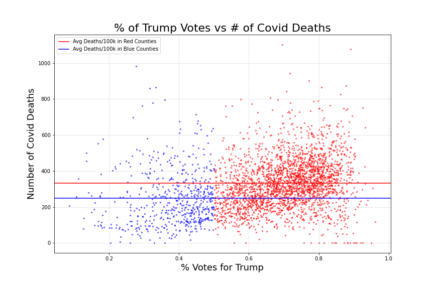
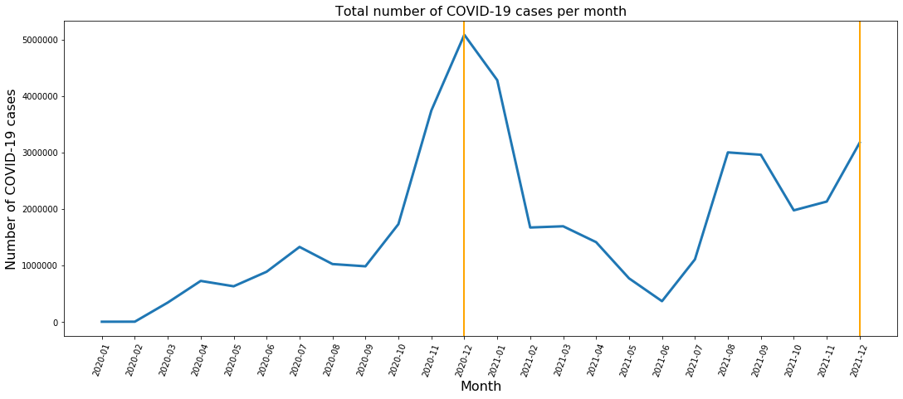
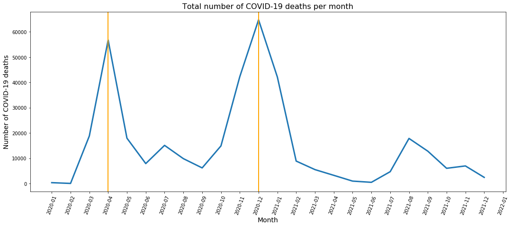
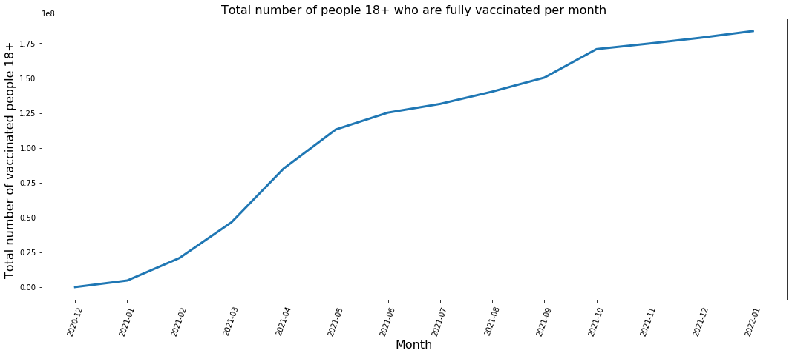
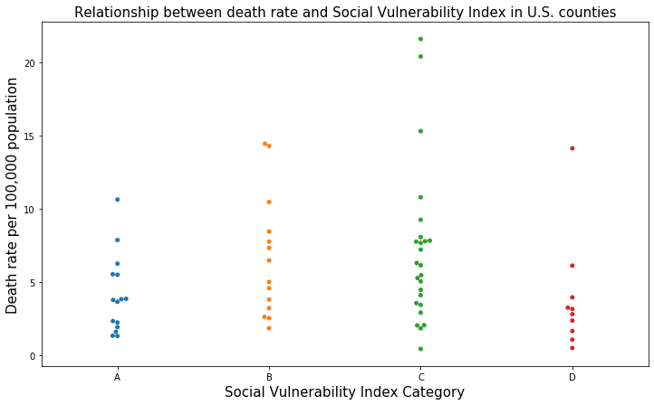
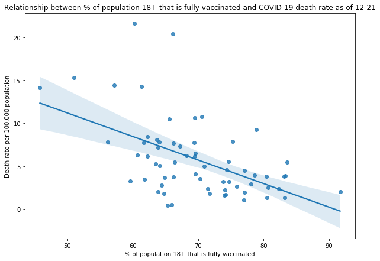

# Covid Relief Analysis

### Problem Statement:

This project will explore county-level variables related to COVID-19 and population characteristics to predict whether a county should be targeted for COVID-19 relief based on whether a county has a median death rate above the 75th percentile nationally among all COVID-19 cases between 2020 and 2021.

### Data Dictionary

The following data sources were used in this analysis. Please download them and place these files in your `data` folder to execute the notebooks used in this analysis:
* [Annual County Resident Population Estimates by Age, Sex, Race, and Hispanic Origin: April 1, 2010 to July 1, 2019 (CC-EST2019-ALLDATA) for the United States](https://www.census.gov/data/tables/time-series/demo/popest/2010s-counties-detail.html)
* [Election Data from MIT](https://electionlab.mit.edu/data)
* [Current Hospital Capacity Estimates – Snapshot](https://www.cdc.gov/nhsn/covid19/report-patient-impact.html) - Please download the national and state estimates NHSN COVID-19 Modulde data
* [COVID-19 Vaccinations in the United States by County from the CDC](https://data.cdc.gov/Vaccinations/COVID-19-Vaccinations-in-the-United-States-County/8xkx-amqh)
* [Labor force data by county, 2020 annual averages from the Bureau of Labor Statistics](https://www.bls.gov/lau/)
* [COVID-19 Case Surveillance Public Use Data with Geography from the CDC](https://data.cdc.gov/Case-Surveillance/COVID-19-Case-Surveillance-Public-Use-Data-with-Ge/n8mc-b4w4)
* [Mask use by county from the New York Times](https://github.com/nytimes/covid-19-data/tree/master/mask-use)
* [Number of deaths per county from the New York Times (`us-counties-recent.csv`)](https://github.com/nytimes/covid-19-data)
* [United States COVID-19 County Level of Community Transmission as Originally Posted](https://data.cdc.gov/Public-Health-Surveillance/United-States-COVID-19-County-Level-of-Community-T/8396-v7yb)
* [COVID-19 Reported Patient Impact and Hospital Capacity by Facility](https://healthdata.gov/Hospital/COVID-19-Reported-Patient-Impact-and-Hospital-Capa/anag-cw7u)
* [County population characteristics](https://www.openintro.org/data/?data=county_complete)

| Variable Name | Description |
|:---|:---|
| county_fips_code | Unique identifier for each county. |
| cases | Number of covid cases aggregated at the county level |
| deaths | Number of deaths from covid aggregated at the county level |
| stname | State that the county resides in |
| ctyname | Name of the county |
| Tot_pop | Total county population |
| deaths_per_hun_thou | Number of covid deaths per 100,000 people |
| unemployment_rate | County unemployment rate |
| med_cases_per_100k_change | Median number of new cases in a 7-day window per 100,000 people across all reporting periods |
| med_per_test_results_positive | Median number positive test results in a 7-day window across all reporting periods |
| transmission_level_high | Percentage of reporting periods where the community transmissibility level, as defined by the CDC, was high |
| transmission_level_low | Percentage of reporting periods where the community transmissibility level, as defined by the CDC, was low |
| transmission_level_moderate | Percentage of reporting periods where the community transmissibility level, as defined by the CDC, was moderate |
| transmission_level_substantial | Percentage of reporting periods where the community transmissibility level, as defined by the CDC, was substantial |
| InBedsOccAnyPat__Numbeds_Est | By state, across all reporting periods, the median percentage of inpatient beds occupied |
| InBedsOccCOVID__Numbeds_Est | By state, across all reporting periods, the median percentage of inpatient beds occupied by patients with confirmed or suspected COVID-19 |
| ICUBedsOccAnyPat__N_ICUBeds_Est | By state, across all reporting periods, the median percentage of ICU beds being occupied |
| cases_per_10k | Number of cases per 10,000 population |
| high_transmission | The percentage of reporting periods where the community transmissibility was high or substantial |
| mask_never | % of survey respondents that reported never wearing a mask when coming in contact with people. |
| mask_rarely | % of survey respondents that reported rarely wearing a mask when coming in contact with people. |
| mask_sometimes | % of survey respondents that reported sometimes wearing a mask when coming in contact with people. |
| mask_frequently | % of survey respondents that reported frequently wearing a mask when coming in contact with people. |
| mask_always | % of survey respondents that reported always wearing a mask when coming in contact with people. |
| good_masking_practices | % of county that responded with frequently or always to the mask survey |
| biden_votes | # of votes received by biden in a county |
| trump_votes | # of votes received by trump in a county |
| total_votes | Total # of votes cast in a county |
| land_area_sqmi | Total land area of a county in square miles |
| population_density | tot_pop/land_area_sqmi |
| total_beds_7_day_sum | Total number of hospital beds in the county |
| inpatient_beds_used_7_day_sum | Total number of inpatient beds occupied |
| inpatient_beds_used_covid_7_day_sum | Total number of inpatient beds occupied where the patient was diagnosed with COVID |
| inpatient_beds_7_day_sum | Total number of inpatient beds |
| total_icu_beds_7_day_sum | Total number of icu beds |
| total_staffed_adult_icu_beds_7_day_sum | Total number of staffed icu beds |
| icu_beds_used_7_day_sum | Total number of icu beds occupied |
| staffed_icu_adult_patients_confirmed_covid_7_day_sum | Total number staffed icu beds occupied where the patient was diagnosed with COVID |
| total_adult_patients_hospitalized_confrimed_covid_7_day_sum | Total number of adult patients hospitalized with diagnoses of COVID |
| county_vac_pct | Represents the proportion of fully vaccinated people whose Federal Information Processing Standards (FIPS) code is reported and matches a valid county FIPS code in the jurisdiction. |
| SVI__A | Overall social vulnerability is measured by CDC Social Vulnerability Index (SVI), which uses U.S. Census data on categories like poverty, housing, and vehicle access to estimate a community's ability to respond to and recover from disasters or disease outbreaks. 0 - 0.25 |
| SVI__B | Overall social vulnerability is measured by CDC Social Vulnerability Index (SVI), which uses U.S. Census data on categories like poverty, housing, and vehicle access to estimate a community's ability to respond to and recover from disasters or disease outbreaks. 0.2501 - 0.50 |
| SVI__C | Overall social vulnerability is measured by CDC Social Vulnerability Index (SVI), which uses U.S. Census data on categories like poverty, housing, and vehicle access to estimate a community's ability to respond to and recover from disasters or disease outbreaks. 0.501 - 0.75 |
| SVI__D | Overall social vulnerability is measured by CDC Social Vulnerability Index (SVI), which uses U.S. Census data on categories like poverty, housing, and vehicle access to estimate a community's ability to respond to and recover from disasters or disease outbreaks. 0.7501 - 1.0 |
| tot_male | Total male population per county |
| tot_female | Total female population per county |
| tot_wa_pop | Total white population per county |
| tot_ba_pop | Total black population per county |
| tot_aa_pop | Total asian population per county |
| tot_na_pop | Total Native hawaiian and Other pacific islander population |
| tot_ia_pop | Total American Indian and Alaska Native population |
| minority_group_total | Total of all minority columns |

### Data  
We started by looking at CDC data on the general characteristics of COVID cases county wide. This dataset would be the foundational data that we add on additional valuable features, recorded and engineered from other publicly available data. This other data was provided by governmental organizations such as the Center for Control and Disease, the U.S. Bureau of Labor Statistics, and the United States Census Bureau. When dealing with any sort of public record data, we were privy to the knowledge that this data is very dirty and often requires a lot of cleaning to perform exploratory data analysis (EDA) and possible modeling. 

We took each dataset that we found, identified any null features or values, engineered additional features, and performed simple EDA for cursory analysis. We then merged all the relevant data into one complete set that we would perform final EDA and modeling with. Our data is indexed with the US county it originates from; the numerical values equating to the mean of values from that county over a brief window of time. We ultimately created a Dataframe with 3,133 observations of 54 rows.

### EDA

Upon initial examination of our deaths variable, we see that it is highly skewed left which leads us to change our target variable to be number of deaths per 100k residents in a county. This variable follows a much more normal distribution and will be better for our modeling process down the road. While examining the target variables relationship with the rest of our data, we observed strong linear relationships with both county population, and number of deaths. 

Because the pandemic has been so widely politicized, a lot of our exploratory analysis was done through a political lense, and across a wide variety. Counties that had >50% of their votes go to Trump had on average 333 deaths per 100k residents, while counties with >50% of their votes going to Biden had on average 249 deaths per 100k residents. 

We also noted the presence of a relationship between a counties percentage of minority residents and the number of deaths per 100k residents, which lead us to believe that it was possible that minorities are being disproportionately impacted by covid-19.

As of January, 2022, there have been 878,000 deaths due to COVID-19 in the United States. The coronavirus, which first was discovered in the United States in January 2020, has created a public health emergency that prompted the development of new vaccines to prevent the spread of this virus. The plot below shows that the number of COVID-19 cases across all U.S. counties as reported by the CDC’s case surveillance data set have increased significantly between 1/20 to 12/21, reaching a peak on 12/20. The number of cases dropped significantly in 2021, as several COVID-19 vaccines became widely available across the United States. 

The number of deaths increased significantly prior to the availability of the vaccine, and dropped steadily after the vaccine became widely available in the U.S. in early 2021.

It is clear from the plot below that as more people in the U.S. vaccinated, the number of deaths dropped significantly.

Examining the relationship between the share of the population ages 18 and over that have been fully vaccinated with the number of deaths per capita per hundred thousand population (death rate) during December, 2021, among counties with a death rate above zero presents a moderate linear and negative relationship between the share of the population that is vaccinated and the death rate. In other words, as the share increases, the death rate decreases.

However, certain counties in the U.S. have low levels of vaccination among their adult population. Some of these counties are also among those with the highest median death rates in 2020 and 2021. The map plot below, created with Plotly choropleth maps, displays the counties with the highest median death rates per capita, with darker shades of red representing a higher death rate per capita.

Counties in states such as Texas, Arizona, Florida and in the overall southern United States appear to have a disproportionately higher median number of COVID-19 death rate between 2020 and 2021.

In addition to exploring vaccine uptake among U.S. county residents, it appears that counties with higher levels of social vulnerability as measured by the CDC’s Social Vulnerability Index (SVI) appear to have higher median death rates, compared to counties with lower levels of social vulnerability. The Social Vulnerability Index is a measure of the resilience of a community when confronted by external stressors such as a natural disaster or disease outbreak such as COVID-19. SVI level A suggests the lowest level of social vulnerability, while SVI level D suggests the highest level of social vulnerability, or the greatest level of need in terms of poverty and other socioeconomic factors.

### Methodology:

Modeling
	When taking into consideration the dataset being used and the target variable we chose, we deemed it appropriate to try and model the variables in order to predict the target when it comes to ingesting new data. The idea here was to use sklearn’s principal component analysis (PCA) to identify key features from our data that correlate heavily with the target value without being heavily correlated with each other. These variables would then be fitted to a model that would give us a score. This score is the precision predicting the binary target variable which is if a county falls into the 75th percentile of deaths per 100,000 people. 

### Results:

### Modeling
	Our base precision score when looking at the 75th percentile is 0.749. Without running PCA on the dataset, feeding the variables into a Logistic Regression model yielded a precision score of 0.775. This was only a small increase in comparison to our base score. This did not bode well for our hypothesis that the variables had predictive correlation to our target. Finally, PCA was run on the data and the parameters further fed into a grid-search for the ideal values. The PCA outcome revealed that 5 principle components made up ~0.70 of the explained variance. Modeling off those components, our grid-searched Logistic Regression returned a precision score of 0.76 with a standard deviation of +/- 0.03.  In addition to our logistic model we also decided to try a KNN model without PCA to see how it would compare. A gridsearch over this model provided a 78 percent accuracy score on our test data. However we have decided that due to it’s interpretability Logistic Regression is the better model.  

### Conclusion:

Modeling
    Because of the meager difference between our baseline precision score and the modeled precision score, we conclude that Logistic Regression modeling will not be strong enough to predict the 75th percentile of county COVID deaths per 100,000 people when fed new data. Recommendations would come from exploratory analysis of model coefficients and data variables about best practices going forward in counties hit hardest by COVID. 

### Further Analysis - Modeling 
   A majority of the data collected was recorded over different timeframes and only provides a small window in time to the amount of data available. Were we to try modeling again, we would need more data samples over a longer period of time to properly observe changes in order to best predict outcomes of a county's population. Given this is a relatively recent national phenomenon with a shorter timespan, changing data collection implementations, and an evolving cause of problems,  data is a scarcity. 

# covid_relief
